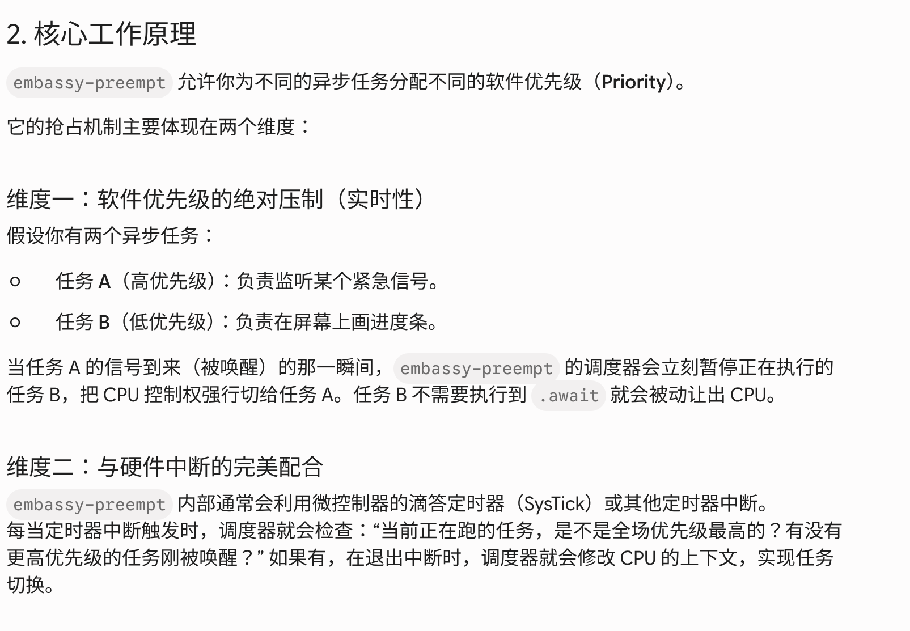

# Notes

## Notes for stage1

### 向：cpu硬件对并发的支持

硬件并发指的是中断导致的，操作系统对并发的支持也是thread，编程语言并发指的是线程
异步操作系统

中断是由硬件轮询检测，因为可以直接加入fetch-exec-wb的链中；而软件总是需要额外的fetch-exec-wb链？
认为用户态中断可以极大地简化signal

### 田：RISC-V用户态中断扩展设计和实现

提出问题：IPC需要上下文切换、数据copy、注册signal函数需要进入kernel等cost
kpti:用户内核的页表分开，防止meltdown

提出解决方法：用户态中断
用户态接受响应中断，跨核异步通知[指的是跨核的IPC，传统上需要发出核进入内核态，发出中断信号，接受核收到中断进入内核态响应；用户态中断下，不需要两次进入内核；异步通知下，不需要发送核等待 接受核返回信息]
需要考虑接收方是谁？接收方如果正在sleep，具体行为是什么？需要控制中断的登记与否[允许谁登记中断]？

riscv n扩展：RISC-V 架构中的 “用户态中断标准扩展”【引入中断委托机制,内核（S态）可以通过设置 sideleg（Supervisor Interrupt Delegation Register）寄存器，把特定的中断委托（Delegate）给 U 态。被委托的中断发生时，硬件会绕过 S 态，直接把控制权交给 utvec 指向的用户态代码]
x86也有用户态中断扩展

介绍riscv的用户它中断扩展机制
增加两个控制寄存器suist、一个uipi指令和一个用户态中断控制器
发送方中断控制寄存器：enable位表示发送方，size发送方状态表大小，ppn发送方状态表大小[表项是[valid位，sender-vec是sender登记的中断向量【即希望接收方触发的中断服务程序】，UIRS-index接受态的index]]
接收方中断控制寄存器：enable位表示接受方，index接收方状态表中本项的entry的index
用户态中断控制器：维护接收方状态表，entry为[active接受中断信号与否，mode决定64位与否，hartid硬件编号，pending记录待处理的用户态中断发送方]
uipi指令：用户程序执行uipi指令来访问用户态中断控制器，sender可以修改目标receiver的pending，receiver则可以设置active位和读取/修改pending位

在riscv硬件qemu上实现用户态中断：Chisel一种硬件描述语言、Rocket-Chip一种Soc生成器、Rocc是前者中定义的协处理器；用Rocc和Rocket-Chip实现上述需要的硬件
软件上，基于linux增加对应系统调用和库函数；用ipc-bench测试

#### 尤：软硬协同的用户态中断机制研究

n扩展寄存器：ustatus、utvec等，sideleg/sedeleg委托用户态处理某些S态中断
riscv上常见的外部中断控制器PLIC，需要把PLIC映射到用户地址用于查找具体的中断

提出一种新的中断控制器UINTC，存储enable(S,R)表示s是否能发给r，pending(s,r)是否存在s发送给r的中断等待处理，listen(c)硬件上下文监听的接收方编号【表示这个receiver是否正在运行】，sender的uiid、receiver的uiid，提供send和receive方法
需要在tcb中维护这些寄存器，另外维护一页中断缓冲区


#### async基础

rust只提供了async、wait、future特征等基本特性，异步运行依赖外部提供的运行时async-runtime，包括一个reactor和多个executor，前者提供向执行器外部事件的注册/唤醒，后者实际推动任务运行
tokio提供了写异步网络服务所需的几乎所有功能，包括多线程的异步运行时，标准阻塞api的异步版本；但不适合CPU密集的任务，不适合读取大量文件[cpu密集型应当使用thread处理]、不适合轻量的http【redis是全内存存储、key-value查找、支持多种数据类型的单线程数据库，常用于Mysql等重型数据库的cache】

复习：future需要poll才执行，async内部维护了所有变量和状态的空间[额外开销是0]构成状态机，tokio实际上创建少量线程处理大量任务[从切换线程变为内存内的切换任务]；在异步函数中用.await等待另一个异步调用完成，但不阻塞当前线程；future特征内部维护poll方法，返回pending/ready状态【pending/ready实际上是由于等待外部资源/**其他线程**，而不是cpu算到一半；[每一次，包括第一次]poll时要注册waker到reactor，当外部资源可用后/**希望再次尝试poll时**，reactor通过waker[真实future中，waker被context结构体代替]通知executor去poll对应的future[或者说enable executor to poll correspond future]】；join!修改子future在reactor中登记的waker为转发唤醒join的复合future，这样任意一个子任务被wake都会导致复合任务全部poll一遍；为什么future需要Pin< mut &self>,因为future对象可能在栈上传递，而future内部字段存在相互指向，必须通过pin保证指针存储的地址仍然是原结构体，即不希望future创建后被移动[返回大对象的函数签名会被编译器修改多加一个指针，并且在函数内部返回时编译器实际控制写入对应地址]；future在async内用.await推动，在最外层用executor推动

tokio::main实际上在main内创建多线程Executor和Rector，然后把async main作为一个任务输入block_on，来阻塞主线程运行异步任务；通过tokio::spawn并发任务

多层await在runtime眼中只有一个注册的task，对应单个状态机；只有spawn产生新的task；只有多个spawn时才体现async的优点，否则退化为非阻塞单线程;spawn接受一个async语句块，spawn后自动poll，返回handle，通过handle.await查询[而不是poll]当前进度[如果spawn没有完成则当前包含有handle.await的async-fn进入pending，等待spawn线程wake；如果完成了则返回ok或err]
tokio::spawn的语句块必须不依赖外部数据，所以常用async move{}移动所有权，并传入Arc来在不同task间访问共享状态
tokio的Mutex只在跨.await时使用[开销大]，因为std:Mutex可能导致sleep的task持有锁导致deadlock

> 需要注意的是，执行任务的线程未必是创建任务的线程，任务完全有可能运行在另一个不同的线程上，而且任务在生成后，它还可能会在线程间被移动。所以async内的对象应该能够安全在线程间移动[多线程不安全的操作不能跨await]
> 【？我觉得这里的例子只是说多个线程同时访问rc时不安全，but async-fn实际上没有被多个线程同时运行，而是在多个线程内交换执行；不同核心不同缓存？】

当同步锁竞争过大时，由以下几种方法缓解：创建专门的任务并使用消息传递的方式来管理状态[一个manger-task恒常持有锁，其他task通知manager来操作被锁保护的量,适用consumer-producer模型]、将锁进行分片、重构代码以避免锁[把调用锁的过程写为方法，在两个await间调用这个方法]；【异步锁基本不能缓解，同步锁会调度thread让无法获取锁的thread去sleep[切换上下文]，异步锁会调度task让抢不到锁的task睡觉[频繁改写executor内部task队列]，因为本质都是同一时刻只有一个单位拥有锁】

> 当竞争不多的时候，使用阻塞性的锁去保护共享数据是一个正确的选择。当一个锁竞争触发后，当前正在执行任务(请求锁)的线程会被阻塞，并等待锁被前一个使用者释放
> 这里的关键就是：锁竞争不仅仅会导致当前的任务被阻塞，还会导致执行任务的线程被阻塞，因此该线程准备执行的其它任务也会因此被阻塞

rust支持若干label，可以在Cargo.tooml中标记，说明项目下某个同名文件夹的代码作用，例如example

TcpListener是监听socket，TcpStream是ConnectSocket，每个连接由listener察觉到，并转发对应一个TcpStream处理；Connect则把流转换为frame

消息传递：创建一个专门的任务 C1 (消费者 Consumer) 控制锁保护资源，所有希望使用的task需要先访问C1,通过C1转发request，并转回response
这通常用mpsc实现，并且消息通道有cache，可以实现更高的吞吐；如果缓冲满，使用send(...).await的发送者会进入睡眠，直到缓冲队列可以放入新的消息(被接收者消费了)；另外需要一个onshot用于反向发回response，且oneshot不需要await[一方面因为oneshot只把信息放到固定坑位，不需要如mpsc接受更多输入；另一方面oneshot的send是fn Once直接拿走tx端所有权]

> Tokio 提供了多种异步消息通道，可以满足不同场景的需求:
> mpsc, 多生产者，单消费者模式
> oneshot, 单生产者，单消费者，一次只能发送一条消息
> broadcast，多生产者，多消费者，其中每一条发送的消息都可以被所有接收者收到，因此是广播
> watch，单生产者，多消费者，只保存一条最新的消息，因此接收者只能看到最近的一条消息，例如，这种模式适用于配置文件变化的监听
> 细心的同学可能会发现，这里还少了一种类型：多生产者、多消费者，且每一条消息只能被其中一个消费者接收，如果有这种需求，可以使用 async-channel 包

waker怎么来的？tokio在spawn时就产生了对应的waker，存储在heap上[圣经的简单例子中提供将task转为waker的方法，实际上也是在spawn-task时就提供了对应的wake]

> 在 Tokio 中我们必须要显式地引入并发和队列,因为async是惰性的[创建了不会自动运行]
> tokio::spawn (生成新任务)
> select! (在多个 Future 中选择最先完成的一个)
> join! (等待多个 Future 全部完成)
> mpsc::channel (消息通道)

tokio还提供若干异步读写方法，和异步io；任何一个读写器( reader + writer )都可以使用 io::split 方法进行分离，最终返回一个读取器和写入器，这两者可以独自的使用，例如可以放入不同的任务中

> 当 Future 会返回 Poll::Pending 时，一定要确保 wake 能被正常调用，否则会导致任务永远被挂起，再也不会被执行器 poll【此时本task从runtime中取出，waker把他放回去】
> 忘记在返回 Poll::Pending 时调用 wake 是很多难以发现 bug 的潜在源头！
> 当实现一个 Future 时，很关键的一点就是要假设每次 poll 调用都会应用到一个不同的 Waker 实例上。因此 poll 函数必须要使用一个新的 waker 去更新替代之前的 waker
> 这是因为可以把执行到一半的future传入spawn得到新task，因为waker是面向task的，这样切换task后应当更新waker，才能在当前task中醒来
> 另外用Option< waker>表示是否已经生成一个线程提供未来的wake，这避免了反复产生发出wake命令的线程[实际上只有第一个有用]

select!语法：同时等待多个操作，等其中一个完成就退出等待，drop其他task[相比之下，join!等待全部完成]
异步task被drop就是取消任务，丢弃所有相关状态；select的本质是合成一个大future同时poll
select!语法：左边（模式匹配Output） = 右边（异步Future） => { 命中后的业务代码 }，会自动poll这些future
select的不同分支可以不可变借用所有权，不必须move；select默认消费掉传入的future，如果在loop中不希望慢完成的task被drop，可以传入&mut future

> ? 的标准定义是：“如果遇到错误，立刻从当前【最近的函数或闭包/async块】中 return 出去”
> 在 select! 中，? 如何工作取决于它是在分支中的 async 表达式使用还是在结果处理的代码中使用:
> 在分支中 async 表达式使用会将该表达式的结果变成一个 Result
> 在结果处理中使用，会将错误直接传播到 select! 之外

tokio的不同并发策略：

> tokio::spawn 函数会启动新的任务来运行一个异步操作，每个任务都是一个独立的对象可以单独被 Tokio 调度运行，因此两个不同的任务的调度都是独立进行的，甚至于它们可能会运行在两个不同的操作系统线程上。鉴于此，生成的任务和生成的线程有一个相同的限制：不允许对外部环境中的值进行借用。
> 而 select! 宏就不一样了，它在同一个任务中并发运行所有的分支。正是因为这样，在同一个任务中，这些分支无法被同时运行。 select! 宏在单个任务中实现了多路复用的功能

Stream：异步迭代器
stream.next()返回future对象，相当于iterator每次迭代生成一个future，future持有可变借用防止stream提前生成下一个迭代对象future
支持适配器：消耗原iter并构成新stream/生成一个值

spawn_block(fn)在异步程序中运行小部分同步代码
block_on(async fn)在同步代码中运行异步代码:阻塞直到async-fn返回ready，需要构造tokio运行时rt，用rt.block_on()阻塞线程运行异步程序；rt建立时申请若干thread，block_on时才派发task占据线程运行
runtime.spawn()则直接开始运行task；这也依赖使用multi_thread运行时而非current_thread[此时tokio的task必须运行在当前线程上]
消息传递的方式：开一个异步rt线程，用tokio::spawn运行接收到的task,其他线程需要async-rt时把task发给这个manager-thread即可

command创建进程，std::thread 创建线程

## Notes for stage2

### tokio_future

future的实施由future crate提供，rust的future是基于轮询的，通过callback唤起轮询【这里的轮询poll-based指的future需要反复.poll直到返回Ready()；相比之下go等接受并运行委托的任务并直接运行完毕，通过传入的callback-func推送回协程栈】

关于green-thread：如果把green-thread作为rust内置runtime的支持，会给小的rust程序带来很大的runtime负载

关于零成本抽象：参考<https://zhuanlan.zhihu.com/p/97574385>
**基于回调/推送的模型**传递闭包，实际上是传递结构体(指针) [编译期把闭包拆分为一个全局函数和一个结构体]，结构体需要保存闭包内部变量[heap上]，如果多层callback则需要多次构造并传递闭包[多次在heap上分配匿名结构体，且为了嵌套返回，不能释放之前的结构体，必须一直保持直到全部完成]，同时为了将不同类型的对应fn写入Eventloop的全局队列[vec的子类型需要相同]，需要用Box< dyn Fn>包装，这就把原本闭包的静态分发变成了动态分发[总是需要查表跳转]【这里的结构体有点像栈？】；本模型返回的future登记了后续的回调函数链，也维护内部状态和结果，future.then(f)如果已经state==ready则用f构成新future，如果不ready则把f登记到本future的回调链上
**基于poll的future模型**加入executor，并且把以上多层结构体统一为一个状态机[enum类型，各种变体对应不同状态，用union作为heap上类型来保证装得下各类变体的不同内存大小]，同时编译器为每个future状态机结构体实现了对应的poll函数[trait定义]可以直接静态分发[静态分发不但减少一次jr，也方便后端优化]，另外只要drop这个future即可直接取消任务
**综上所述**，我们说rust的无栈协程没有额外开销[相对人类最优的手写异步实现和其他现有实现]，就是说它只需要申请运行任务过程中必须的内存，一点都不多占，同时在call-func时也和静态分发一样，没有动态跳转的开销

> 零成本抽象有两个方面：这也是为什么rust放弃green-thread，转向future，并不把tokio放入语言特性的原因
> 该功能不会给不使用该功能的用户增加成本，因此我们不能为了增加新的特性而增加那些会减慢所有程序运行的全局性开销。
> 当你确实要使用该功能时，它的速度不会比不使用它的速度慢。如果你觉得，我想使用这个非常好用的功能把开发工作变得轻松，但是它会使我的程序变慢，所以我打算自己造一个，那么这实际上是带来了更大的痛苦。

async函数是语法糖，实际上转化为实现了future特征的结构体，对async函数的调用返回初始化的该结构体[结构体定义不占内存，只在编译期出现]；相似地，传递闭包实际上是传递[一个包含了局部变量的匿名struct对象]，编译器同时构造一个[接受这个结构体的普通函数]，在调用时使用

> 在 Rust 还没有 async/await 语法糖的早期，开发者模仿函数式编程，提供了一系列 组合子（Combinators），如 and_then、map、or_else;future调用这些方法形成新future，新future是一个结构体，存储旧future和fn；当poll这个新future，先poll内部旧future，如果返回ready则传入f形成新future并poll[以and_then为例]

编译器眼中实际上没有“method”和“function”区分，前者经过name_mangling成为一般函数，而impl关系由编译期symbol-table维护

> 异步IO的问题是如何回到 **由于异步io未返回导致暂停** 的工作流上；实际上异步与否与并发与否是无关的，就是说可以在单线程上运行异步程序，也可以以多线程作为解决异步的手段
> 异步 I/O 的最大问题是它的工作方式 ：在你调用 I/O 时，系统调用会立即返回，然后你可以继续进行其他工作，但你的程序需要决定如何回到调用该异步 I/O 暂停的那个任务线上

异步stream能够多次返回ready状态，每次携带一部分信息；对stream.foreach()返回一个future，内部反复poll[注意虽然在loop中poll原stream，但也会在pending时return等待waker唤醒再继续poll]，这各foreach继承了stream的waker；现代可以用while let语句直接实现相同功能
future提供同步的消息传递模块one_shot【tx开关，rx实现poll】和mpsc，通过.then()等逻辑方法控制不同task相对顺序
设计风格上，尽量细化每个task而避免一个单独的大task包裹若干task，这样waker唤醒时只需要快速poll小task，不需要在大task中寻找具体引发wake的小task[把task交到exceutor手中而不是自己用task管理]

Runtime模型：
同步阻塞：并发阻塞线程，难以解决c10k问题[大量client并发]
同步/异步非阻塞：executor内轮询poll所有task，tasks为空时sleep等待
runtime分为Executor->Timer->Reactor,前者包括后者
当executor为空，executor调用park()把运行权传递到Timer，Timer计算最近的超时任务和剩余可sleep时间 timeout，把timeout传递给Reactor，Reactor通过mio触发系统调用epoll(arg=timeout)一边等待就绪信息，一边等待timeouut到期
以上三者分别运行在thread中【多线程tokio下】，从reactor开始向上传递自己的handle[一个消息通道]，允许通过handle发送指令；handle存储在TLS中【不存储在进程空间，因为不希望非tokio线程获取handle；不存储在stack因为这需要函数体显式传参，如果多层task就需要大量传参】；单线程tokio下，executor、timer和reactor轮流工作，总是听在reactor的epoll，用TLS避免borrow-check、统一api、防止runtime内启动新的runtime
TLS线程本地存储：考虑线程的地址空间，有进程内各线程共享的全局变量，还有自己栈上的函数的局部变量；TLS提供了一段内存，让线程内所有函数都可以访问，线程间隔离

Tokio的网络模型：TCP&UDP
tokio的网络类型是基于轮询的异步模型，Reactor响应epoll触发对应waker

**总结**：可以用Event-loop协作调度来统一 green-thread、无栈协程和call-back；都是维护若干任务，等待waker唤醒指定任务【修改task状态/将task放入就绪队列】，然后执行并重新sleep；不同任务通过上述方式协作式调度

### 200 line future

接下来介绍一些并发方法：

线程:操作系统提供
简单易用，但是系统线程的堆栈大，且系统有其他任务，切换可能比较慢

green-thread：在系统提供的thread内部建立若干用户态的子线程[实际上只需要维护context和各green-thread的闭包，在单个thread内实现执行流的转换]，各自拥有开始很小但允许动态增长的栈，所有green-thread共享heap和地址空间
在用户态维护一个main-thread上运行runtime负责切换；通过在green-thread的私有栈上存储需要它运行的函数的地址，配合rsp在ret时的行为，实现交换执行流

基于回调的方法：基于回调的方法背后的整个思想就是保存一个指向一组指令的指针，这些指令我们希望以后在以后需要的时候运行
优点是易于实现，没有上下文切换，内存开销较低；缺点是回调嵌套调用带来内存需求，另外由于需要回调，比较难写
在runtime中维护sender/receiver和一个< id,cbf>hashmap，耗时任务最终通过sender发送id，表示本任务运行完成，下一个运行cbf函数[cbf函数往往不耗时，在main-thread上进行]

引入promise作为一种解决回调复杂性的方法【类似future】
promise简化回调的格式，通过.then()传递；promise处于以下三种状态之一: pending、fulfilled 或 rejected；可以将promise视为若干子promise，当子任务状态从pending更改为fulfilled或rejected就继续执行
js的promise是early-evaluate的，一旦被创建则立刻执行

Rust的future实现：无栈协程
leaf-future和non-leaf-future：leaf-future是真正等待的资源，例如tcpstream；non-leaf-future指的是用async创建的Future，通常由await一系列leaf-future构成，是可以保存状态以便暂停和继续的状态机
rust提供了future-trait定义，async和await关键字来形成匿名状态机的机制，和Context、waker定义[poll函数中使用cx.waker.wake()；这为底层驱动提供统一的唤醒格式]
poll中处在await之间的代码运行在executor线程上【和callback-func在main-thread上运行cbf很相似】；为了避免这一点，可以把整个task发送到另一个线程，并视为leaf-future，避免cpu密集任务占用execotor轮询tasks

Waker：包含一个data指针、一个vtable虚函数表[trait指针也类似；只需要vtable内的函数了解data的字段分布即可，这就是为什么trait-obj不需要了解实际struct字段]
waker的本质是手搓的trait-obj，但是不希望收到trait的限制【trait一般只能Box dyn trait或Arc dyn trait使用，waker希望高可变】：两个8byte指针，一个指向任务数据，一个指向包含waker函数的vtable;[实际上任何fatptr都是如此，可以通过std::mem::transmute把由两个ptr构成的结构体【需要符合repr(C)】转换为任意指定fatptr类型]
vtable的前3格有约定，分别是drop函数、vatble的dentry数量size，alignment字节数
通过启动一个拥有waker的thread，可以在thread完全不受tokio-runtime控制的情况下，wake指定的tokio异步任务；允许在异步runtime中嵌入同步线程

Generateor与async
generator函数允许暂停恢复的函数，内部用Yield暂停并用resume恢复，类似现在的rust await模型【一种无栈协程、状态机】【与await的区别是，yield在返回Yielded状态时也携带值，await在返回pending是不携带值】
rust的future0.1使用Combinators组合future任务，接近回调，所以带来内存开销【回调时要保持所有链条上闭包的空间，而无栈协程/生成器只需要保留最大的即可】
在引入pin之前，于闭包内使用yield将其转化为生成器，通过.resume()得到返回状态Completed/Yielded【注意resume返回的值是阶段性成果，generator内部可以维护多个状态，在不同状态返回不同值的枚举类型Yield(type)】
为了允许跨await/yield的引用【这需要在future结构体内保存一个变量和对他的引用[而rust需要描述引用的生命周期，但不支持描述自引用的生命周期[必须用裸指针]，只支持使用外部传入的生命周期]，否则就要用Arc包裹所有涉及引用的变量，或者用Combinator链式移动所有权】

引入Pin解决自引用导致状态不一致：Pin限制获取mut&，规避了swap两个future导致的**safe下自引用地址错误**
一般用Pin包裹&mut独占可变引用，此时只能通过pin得到可变引用【需要通过变量遮蔽，让pin对象代替原对象，防止drop pin释放可变引用偷跑】
Pin与结构体字段_marker: PhantomPinned配合，对于没有_marker的结构体，允许通过Pin得到mut引用；反之则不允许[这个检查发生在编译期]；只有_marker没有用；限制方法参数为Pin<& muttype>，则限制获取type的mut引用，除非通过unsafe
增加marker字段和impl !Unpin是效果类似的：marker字段是0字节的!unpin对象，传染到结构体[只要一个结构体中包含了任何一个 !Unpin 的字段，整个结构体就会自动变成 !Unpin]；impl !Unpin显式声明
需要把Generator的resume方法实现为接受Pin<&mut self>,这可以通过调用Pin的as_mut()实现；在resume内部用unsafe获取self对象的可变引用；Pin阻止的是get_mut返回&mut [impl Generator的类型]；实际上避免直接操作结构体，而总是通过Pin实现

> 堆分配与栈分配：把原本在stack上建立future对象移动到heap上，保证自引用不会因函数传参而不一致
> 将一个!UnPin的指向栈上的指针固定需要unsafe,在stack上只能在unsafe{}内从指定引用新建Pin
> 将一个!UnPin的指向堆上的指针固定,不需要unsafe,可以直接使用Box::Pin从指定引用新建Pin[相当于移动到堆上]
> Pin保证从值被固定到被删除的那一刻起一直存在。 而在Drop实现中，您需要一个可变的 self 引用，这意味着在针对固定类型实现 Drop 时必须格外小心：不要在drop中把数据移动，这会引发自引用不一致

Rust的Waker内部维护裸的wake-data和VTABLE的地址[运行时提供]，至少需要提供clone、drop、wake三种函数；用于规定waker的传递格式，在poll中通过waker调用VTABLE中的函数
park的工作：EventQueue为空时，让主线程park进入sleep状态；有waker被调用时unpark继续运行

### 200 line stack-less routine

> async函数是有函数体的，就是组装一个future对象并box::pin它返回

确实很简短，基本只通过rust的async语法把clossure打包为future，放入executor的queue，连reactor都没有，executor只是轮询，waker基本是空实现

### Rust's Journey to Async/await

沿着rust的发展，聊聊并行并发和异步

> 人们经常把异步计算和并行计算、并发计算混为一谈。这三个概念的定义常常被混淆。为了明确起见，并行计算是指能够同时执行多个任务。并发编程是指能够执行多个任务，但不能同时进行。异步编程实际上与这两者都无关，它是一种完全不同的方法。让我们更深入地探讨一下
> 协作式多任务处理和抢占式多任务处理。协作式多任务处理是指所有任务必须相互协作才能异步运行。每个任务自行决定何时愿意放弃特定资源，让其他任务取而代之;在不可信的系统中，通常需要抢占式多任务处理，但这样做也会增加一些开销、复杂性和其他问题。如果系统中只有可靠的参与者，那么协作式多任务处理可能更合适一些
> 绿色线程也称为 N:M 或 M:N 线程,指的是将一定数量的自身任务映射到操作系统线程上；green-thread的优势除了更小的stack[相比thread]，也有因为运行在用户态，所以可以了解并优先处理程序的细节以及程序各个部分的运行方式【反过来，也向os隐藏了这些信息】；此外，当你调用 C 代码时，C 需要一个实际的栈。当你需要在绿色线程的栈和原生系统的栈之间切换时，这会引入一些开销；绿色线程确实存在一个很大的缺点：调用 C 代码时速度会变慢，因为c的stack往往极重
> 同步且阻塞的优势在于它非常简单直接，但性能极差[loop pollin]，因此它从来都不是一个可行的选择;异步且非阻塞的好处在于[waker-polling]，你无需改变代码编写方式。你只需像往常一样编写代码，就能获得性能提升，因为运行时会在底层执行常规操作g

Rust1.0决定抛弃green-thread，只实现基础的1：1系统线程，但是这导致高IO难以处理；这里引入了evented IO【inspired by Nginx】：
事件驱动型 I/O (evented I/O)，允许你创建事件，并为每个事件注册一个处理程序，然后在事件实际发生时触发该处理程序；不需要多个线程，因为事件循环本身就是一个单线程，负责处理所有这些操作，同时大部分操作都处于休眠状态

future和promise的不同：前者是lazy依靠poll，后者是立刻开始工作的通过then接听结果

为了实现在裸机上使用future，原本future0.1将context参数存储到TLS中，在future0.2中转为了显式参数context；原本存在future-trait的相关类型Error因为设计future只用于网络io，后来发现可以作为更广泛用途不会出现error就取消了只保留output类型

引入async/await作为编译形成pin匿名结构体保护跨await点的机制，极大简化了书写难度【跨await的项的生命周期】，降低内存压力【跨await项需要分配到heap保证存在】；后置.await的诞生也经历曲折

## Notes for stage3

### Embassy

嵌入式应用框架 Embassy：提供了HAL和executor、网络蓝牙等驱动
通过中断打断协作式异步无栈协程实现优先级

通过#[embassy_executor::task]定义任务
Embassy应用的入口函数用#[embassy_executor::main]宏来定义，要求传入两个参数：Spawner、Peripherals。Spawner用于应用创建任务，Spawner是主任务创建其他任务的途径。 Peripherals来自HAL，它负责沟通可能用到的外设
main宏做了以下的事情：

1. 创建一个Embassy执行器。
2. 初始化硬件层并通过Peripherals参数提供交互。
3. 为程序入口定义主任务。
4. 运行执行器生成主任务。

为了使用设备，提供了PAC和HAL两种控制方式：前者是busywait，需要大量配置代码[也可以wfe等待中断]；后者隐藏细节，并允许设备进入睡眠模式
考虑中断驱动，在支持中断驱动时，要么使用宏简化配置，要么用PAC+HAL实现中断登记和触发：

不使用embassy提供的宏入口：

```rs
#![no_std]
#![no_main]

use core::cell::RefCell;

use cortex_m::interrupt::Mutex;
use cortex_m::peripheral::NVIC;
use cortex_m_rt::entry;
use embassy_stm32::gpio::{Input, Level, Output, Pin, Pull, Speed};
use embassy_stm32::peripherals::{PB14, PC13};
use embassy_stm32::{interrupt, pac};
use {defmt_rtt as _, panic_probe as _};

static BUTTON: Mutex<RefCell<Option<Input<'static, PC13>>>> = Mutex::new(RefCell::new(None));
static LED: Mutex<RefCell<Option<Output<'static, PB14>>>> = Mutex::new(RefCell::new(None));

#[entry]
fn main() -> ! {
    let p = embassy_stm32::init(Default::default());
    let led = Output::new(p.PB14, Level::Low, Speed::Low);
    let mut button = Input::new(p.PC13, Pull::Up);

    cortex_m::interrupt::free(|cs| {
        enable_interrupt(&mut button);

        LED.borrow(cs).borrow_mut().replace(led);
        BUTTON.borrow(cs).borrow_mut().replace(button);

        unsafe { NVIC::unmask(pac::Interrupt::EXTI15_10) };
    });

    loop {
        cortex_m::asm::wfe();
    }
}

#[interrupt]
fn EXTI15_10() {
    cortex_m::interrupt::free(|cs| {
        let mut button = BUTTON.borrow(cs).borrow_mut();
        let button = button.as_mut().unwrap();

        let mut led = LED.borrow(cs).borrow_mut();
        let led = led.as_mut().unwrap();
        if check_interrupt(button) {
            if button.is_low() {
                led.set_high();
            } else {
                led.set_low();
            }
        }
        clear_interrupt(button);
    });
}
//
//
//
```

异步实现：通过main宏简化了中断调用的实现

```rs
#![no_std]
#![no_main]
#![feature(type_alias_impl_trait)]

use embassy_executor::Spawner;
use embassy_stm32::exti::ExtiInput;
use embassy_stm32::gpio::{Input, Level, Output, Pull, Speed};
use {defmt_rtt as _, panic_probe as _};

#[embassy_executor::main]
async fn main(_spawner: Spawner) {
    let p = embassy_stm32::init(Default::default());
    let mut led = Output::new(p.PB14, Level::Low, Speed::VeryHigh);
    let mut button = ExtiInput::new(Input::new(p.PC13, Pull::Up), p.EXTI13);

    loop {
        button.wait_for_any_edge().await;
        if button.is_low() {
            led.set_high();
        } else {
            led.set_low();
        }
    }
}
```

Executor：功能亮点
无需一直轮询：没有任务时，配合中断或WFE/SEV （Wait For Event/Wait For Interrupt），CPU可以进入休眠状态；
支持创建多个执行器实例，并以不同优先级运行任务。遇到优先级低的任务，较高优先级的任务可以抢占运行。

bootloader：embassy-boot 是一个轻量级引导加载程序，支持以断电保护安全方式升级固件应用程序，并且还具有尝试引导和回滚的功能。
此引导加载程序把存储介质分为 4 个主要的分区，可以在创建引导加载程序实例的时候或者通过链接脚本（linker script）来配置：BOOTLOADER、ACTIVE、DFU[用于固件ACTIVE升级]、BOOTLOADER-STATE


不同等级地实现优先级，preempt用信号实现优先级

Embassy和Embassy-preempt都已经存在trace模块了

### Embassy_preempt

基于二层bitmap的优先级task查找，不支持多个相同优先级任务
提供两个poll方法，一般poll内部维护循环不断选择最高优先级运行，int_poll在中断时调用
sync和async都是包装为async函数，stack在int时使用保存运行到一半的情况，在contextswitch中保存。poll循环时恢复
